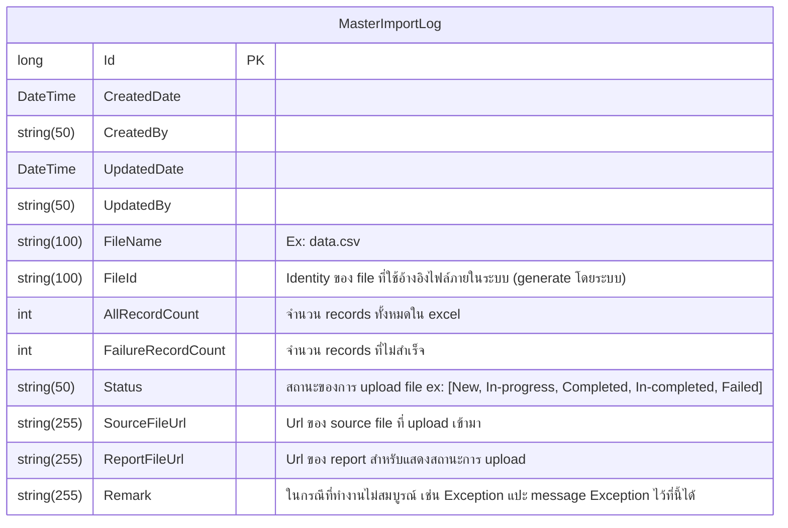

```mermaid
erDiagram
    MasterImportLog {
        long Id PK
        DateTime CreatedDate
        string(50) CreatedBy
        DateTime UpdatedDate
        string(50) UpdatedBy
        string(100) FileName "Ex: data.csv"
        string(100) FileId "Identity ของ file ที่ใช้อ้างอิงไฟล์ภายในระบบ (generate โดยระบบ)"
        int AllRecordCount "จำนวน records ทั้งหมดใน excel"
        int FailureRecordCount "จำนวน records ที่ไม่สำเร็จ"
        string(50) Status "สถานะของการ upload file ex: [New, In-progress, Completed, In-completed, Failed]"
        string(255) SourceFileUrl "Url ของ source file ที่ upload เข้ามา"
        string(255) ReportFileUrl "Url ของ report สำหรับแสดงสถานะการ upload"
        string(255) Remark "ในกรณีที่ทำงานไม่สมบูรณ์ เช่น Exception แปะ message Exception ไว้ที่นี้ได้"
    }
```