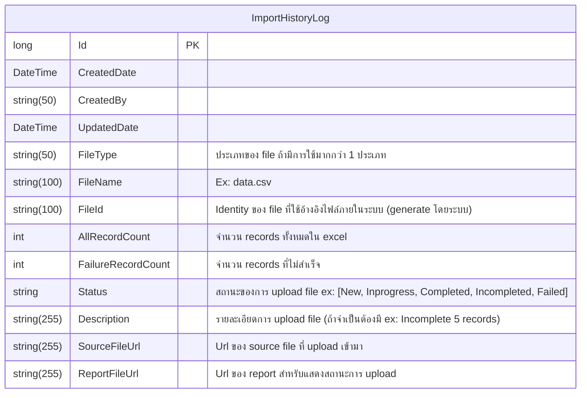

```mermaid
erDiagram
    ImportHistoryLog {
        long Id PK
        DateTime CreatedDate
        string(50) CreatedBy
        DateTime UpdatedDate
        string(50) FileType "ประเภทของ file ถ้ามีการใช้มากกว่า 1 ประเภท"
        string(100) FileName "Ex: data.csv"
        string(100) FileId "Identity ของ file ที่ใช้อ้างอิงไฟล์ภายในระบบ (generate โดยระบบ)"
        int AllRecordCount "จำนวน records ทั้งหมดใน excel"
        int FailureRecordCount "จำนวน records ที่ไม่สำเร็จ"
        string Status "สถานะของการ upload file ex: [New, Inprogress, Completed, Incompleted, Failed]"
        string(255) Description "รายละเอียดการ upload file (ถ้าจำเป็นต้องมี ex: Incomplete 5 records)"
        string(255) SourceFileUrl "Url ของ source file ที่ upload เข้ามา"
        string(255) ReportFileUrl "Url ของ report สำหรับแสดงสถานะการ upload"
    }
```