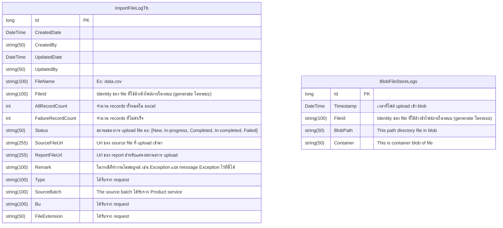

```mermaid
erDiagram
    ImportFileLogTb {
        long Id PK
        DateTime CreatedDate
        string(50) CreatedBy
        DateTime UpdatedDate
        string(50) UpdatedBy
        string(100) FileName "Ex: data.csv"
        string(100) FileId "Identity ของ file ที่ใช้อ้างอิงไฟล์ภายในระบบ (generate โดยระบบ)"
        int AllRecordCount "จำนวน records ทั้งหมดใน excel"
        int FailureRecordCount "จำนวน records ที่ไม่สำเร็จ"
        string(50) Status "สถานะของการ upload file ex: [New, In-progress, Completed, In-completed, Failed]"
        string(255) SourceFileUrl "Url ของ source file ที่ upload เข้ามา"
        string(255) ReportFileUrl "Url ของ report สำหรับแสดงสถานะการ upload"
        string(100) Remark "ในกรณีที่ทำงานไม่สมบูรณ์ เช่น Exception แปะ message Exception ไว้ที่นี้ได้"
        string(100) Type "ได้รับจาก request"
        string(100) SourceBatch "The source batch ได้รับจาก Product service"
        string(100) Bu "ได้รับจาก request"
        string(50) FileExtension "ได้รับจาก request"
    }
    BlobFileStoreLogs {
        long Id PK
        DateTime Timestamp "เวลาที่ไฟล์ upload เข้า blob"
        string(100) FileId "Identity ของ file ที่ใช้อ้างอิงไฟล์ภายในระบบ (generate โดยระบบ)"
        string(50) BlobPath "This path directory file in blob"
        string(50) Container "This is container blob of file"
    }
```