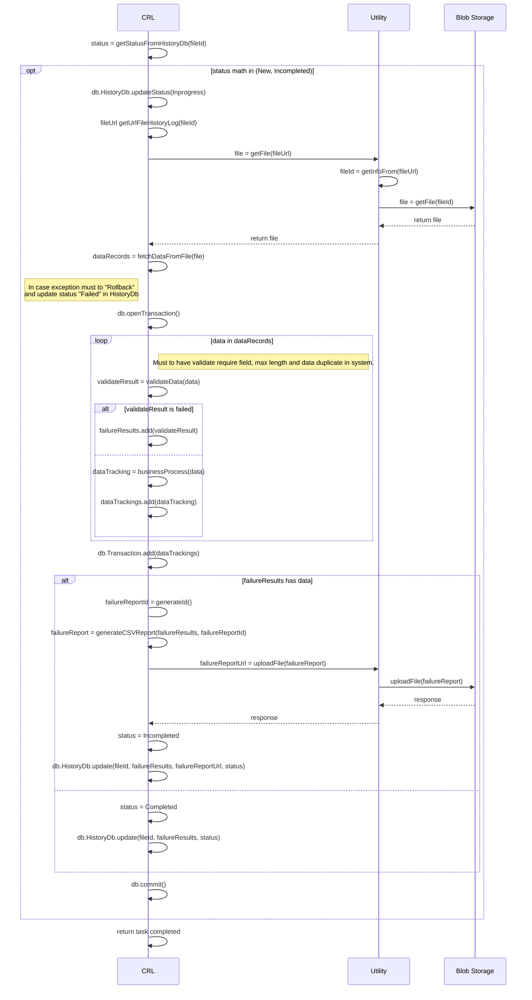

```mermaid
sequenceDiagram
    participant CRL
    participant Utility
    participant Blob Storage
    CRL->>CRL: status = getStatusFromHistoryDb(fileId)
    opt status math in (New, Incompleted)
        CRL->>CRL: db.HistoryDb.updateStatus(Inprogress)
        CRL->>CRL: fileUrl getUrlFileHistoryLog(fileId)
        CRL->>Utility: file = getFile(fileUrl)
        Utility->>Utility: fileId = getInfoFrom(fileUrl)
        Utility->>Blob Storage: file = getFile(fileId)
        Blob Storage-->>Utility: return file
        Utility-->>CRL: return file
        CRL->>CRL: dataRecords = fetchDataFromFile(file)
        Note left of CRL: In case exception must to "Rollback"<br/> and update status "Failed" in HistoryDb
        CRL->>CRL: db.openTransaction()
        loop data in dataRecords
            Note right of CRL: Must to have validate require field, max length and data duplicate in system.
            CRL->>CRL: validateResult = validateData(data)
            alt validateResult is failed
                CRL->>CRL: failureResults.add(validateResult)
            else
                CRL->>CRL: dataTracking = businessProcess(data)
                CRL->>CRL: dataTrackings.add(dataTracking)
            end
        end
        CRL->>CRL: db.Transaction.add(dataTrackings)
        alt failureResults has data
            CRL->CRL: failureReportId = generateId()
            CRL->>CRL: failureReport = generateCSVReport(failureResults, failureReportId)
            CRL->>Utility: failureReportUrl = uploadFile(failureReport)
            Utility->>Blob Storage: uploadFile(failureReport)
            Blob Storage-->>Utility: response
            Utility-->>CRL: response
            CRL->>CRL: status = Incompleted
            CRL->>CRL: db.HistoryDb.update(fileId, failureResults, failureReportUrl, status)
        else
            CRL->>CRL: status = Completed
            CRL->>CRL: db.HistoryDb.update(fileId, failureResults, status)
        end
        CRL->>CRL: db.commit()
    end
    CRL->>CRL: return task completed
```