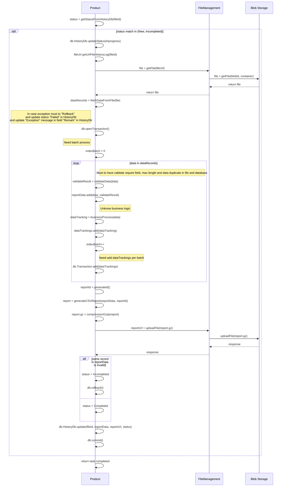

```mermaid
sequenceDiagram
    participant Product
    participant FileManagement
    participant Blob Storage
    Product->>Product: status = getStatusFromHistoryDb(fileId)
    opt status match in (New, Incompleted)
        Product->>Product: db.HistoryDb.updateStatus(Inprogress)
        Product->>Product: fileUrl getUrlFileHistoryLog(fileId)
        Product->>FileManagement: file = getFile(fileUrl)
        FileManagement->>Blob Storage: file = getFile(blobId, container)
        Blob Storage-->>FileManagement: return file
        FileManagement-->>Product: return file
        Product->>Product: dataRecords = fetchDataFromFile(file)
        Note left of Product: In case exception must to "Rollback"<br/> and update status "Failed" in HistoryDb<br/> and update "Exception" message in field "Remark" in HistoryDb
        Product->>Product: db.openTransaction()
        Note left of Product: Need batch process
        Product->>Product: indexBatch = 0
        loop data in dataRecords
            Note right of Product: Must to have validate require field, max length and data duplicate in file and database.
            Product->>Product: validateResult = validateData(data)
            Product->>Product: reportData.add(data, validateResult)
            Note right of Product: Unknow business logic
            Product->>Product: dataTracking = businessProcess(data)
            Product->>Product: dataTrackings.add(dataTracking)
            Product->>Product: indexBatch++
            Note right of Product: Need add dataTrackings per batch
            Product->>Product: db.Transaction.add(dataTrackings)
        end
        Product->Product: reportId = generateId()
        Product->>Product: report = generateCSVReport(reportData, reportId)
        Product->>Product: report.gz = compressionGzip(report)
        Product->>FileManagement: reportUrl = uploadFile(report.gz)
        FileManagement->>Blob Storage: uploadFile(report.gz)
        Blob Storage-->>FileManagement: response
        FileManagement-->>Product: response
        alt some record in reportData is invalid
            Product->>Product: status = Incompleted
            Product->>Product: db.rollback()
        else
            Product->>Product: status = Completed
        end
        Product->>Product: db.HistoryDb.update(fileId, reportData, reportUrl, status)
        Product->>Product: db.commit()
    end
    Product->>Product: return task completed
```