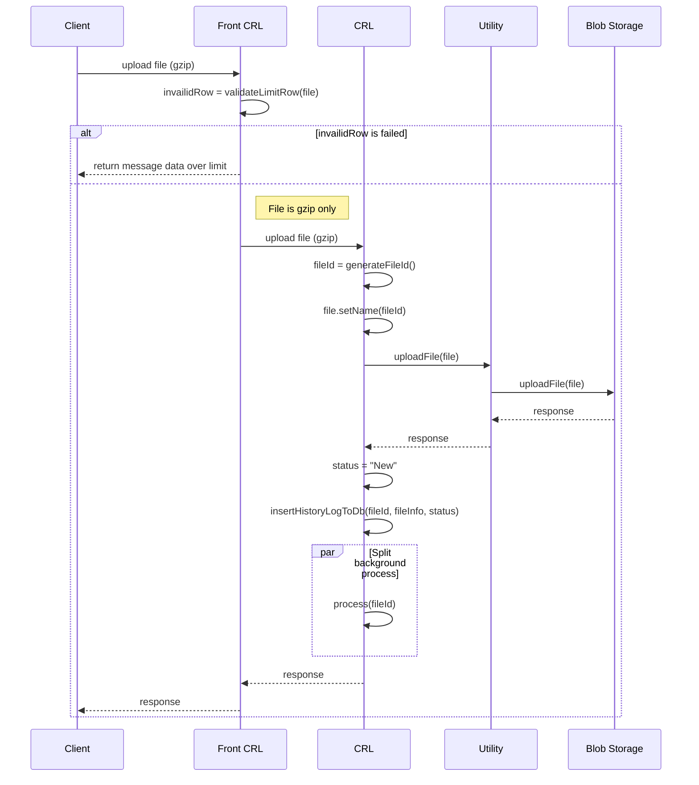

```mermaid
sequenceDiagram
    participant Client
    participant Front CRL
    participant CRL
    participant Utility
    participant Blob Storage
    Client->>Front CRL: upload file (gzip)
    Front CRL->>Front CRL: invailidRow = validateLimitRow(file)
    alt invailidRow is failed
    Front CRL-->>Client: return message data over limit
    else
    Note right of Front CRL: File is gzip only
    Front CRL->> CRL: upload file (gzip)
    CRL->>CRL: fileId = generateFileId()
    CRL->>CRL: file.setName(fileId)
    CRL->>Utility: uploadFile(file)
    Utility->>Blob Storage: uploadFile(file)
    Blob Storage-->>Utility: response
    Utility-->> CRL: response
    CRL->>CRL: status = "New"
    CRL->>CRL: insertHistoryLogToDb(fileId, fileInfo, status)
    par Split background process
    CRL->>CRL: process(fileId)
    end
    CRL-->>Front CRL: response
    Front CRL-->>Client: response
    end
```