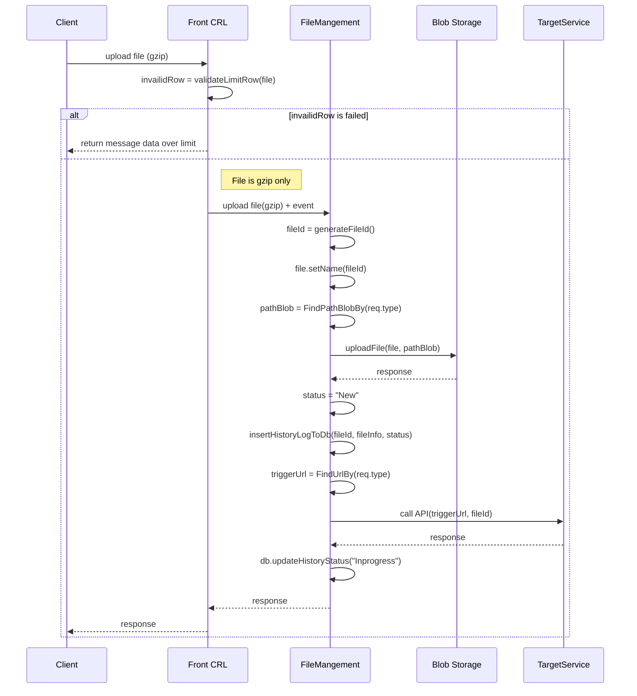

```mermaid
sequenceDiagram
    participant Client
    participant Front CRL
    participant FileMangement
    participant Blob Storage
    participant TargetService
    Client->>Front CRL: upload file (gzip)
    Front CRL->>Front CRL: invailidRow = validateLimitRow(file)
    alt invailidRow is failed
    Front CRL-->>Client: return message data over limit
    else
    Note right of Front CRL: File is gzip only
    Front CRL->> FileMangement: upload file(gzip) + event
    FileMangement->>FileMangement: fileId = generateFileId()
    FileMangement->>FileMangement: file.setName(fileId)
    FileMangement->>FileMangement: pathBlob = FindPathBlobBy(req.type)
    FileMangement->>Blob Storage: uploadFile(file, pathBlob)
    Blob Storage-->>FileMangement: response
    FileMangement->>FileMangement: status = "New"
    FileMangement->>FileMangement: insertHistoryLogToDb(fileId, fileInfo, status)
    FileMangement->>FileMangement: triggerUrl = FindUrlBy(req.type)
    FileMangement->>TargetService: call API(triggerUrl, fileId)
    TargetService-->>FileMangement: response
    FileMangement->>FileMangement: db.updateHistoryStatus("Inprogress")
    FileMangement-->>Front CRL: response
    Front CRL-->>Client: response
    end
```