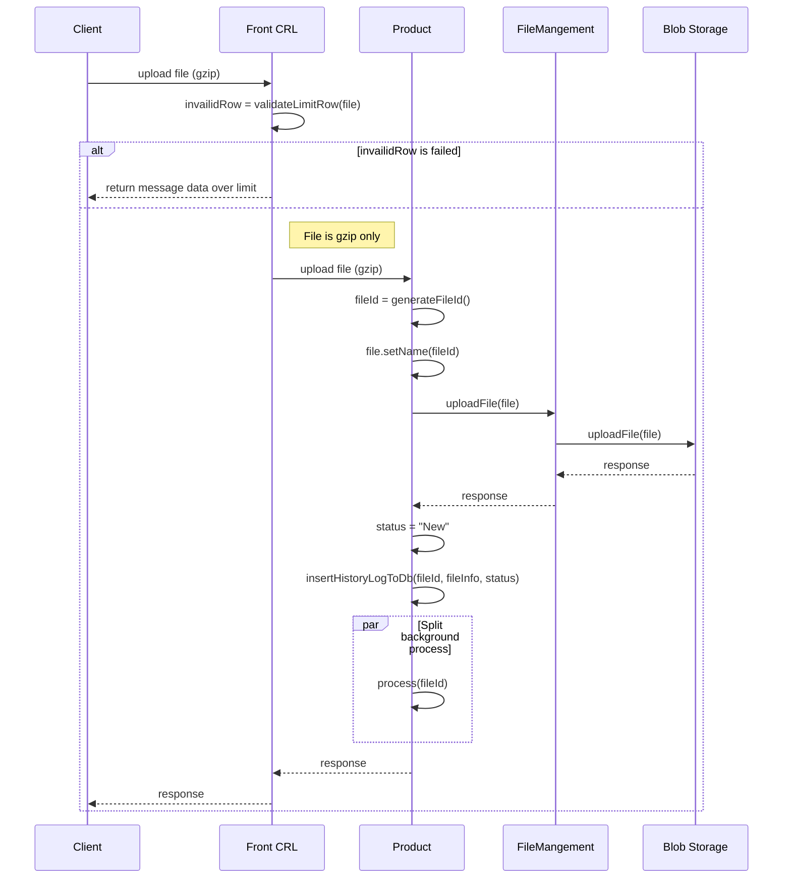

```mermaid
sequenceDiagram
    participant Client
    participant Front CRL
    participant Product
    participant FileMangement
    participant Blob Storage
    Client->>Front CRL: upload file (gzip)
    Front CRL->>Front CRL: invailidRow = validateLimitRow(file)
    alt invailidRow is failed
    Front CRL-->>Client: return message data over limit
    else
    Note right of Front CRL: File is gzip only
    Front CRL->> Product: upload file (gzip)
    Product->>Product: fileId = generateFileId()
    Product->>Product: file.setName(fileId)
    Product->>FileMangement: uploadFile(file)
    FileMangement->>Blob Storage: uploadFile(file)
    Blob Storage-->>FileMangement: response
    FileMangement-->> Product: response
    Product->>Product: status = "New"
    Product->>Product: insertHistoryLogToDb(fileId, fileInfo, status)
    par Split background process
    Product->>Product: process(fileId)
    end
    Product-->>Front CRL: response
    Front CRL-->>Client: response
    end
```