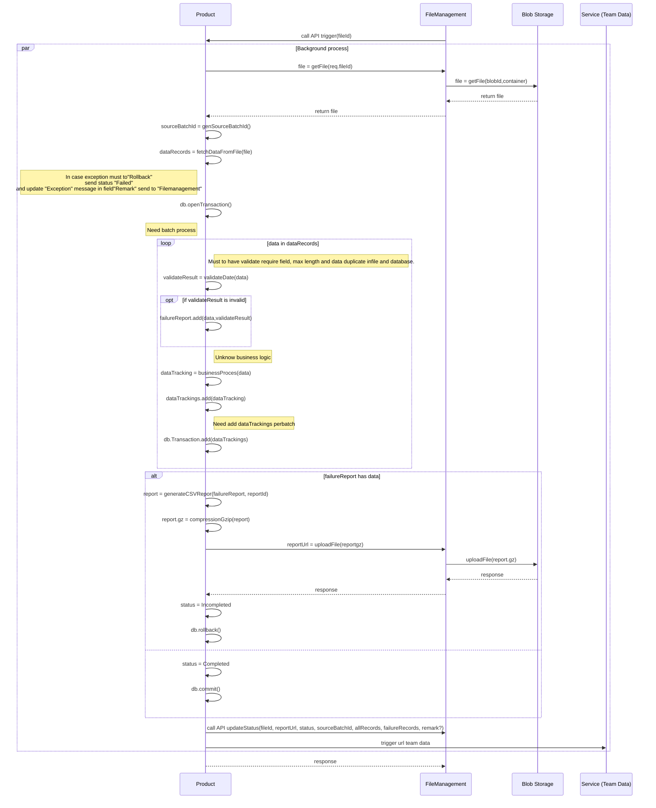

```mermaid
sequenceDiagram
    participant Product
    participant FileManagement
    participant Blob Storage
    participant Service (Team Data)
    FileManagement->>Product: call API trigger(fileId)
    par Background process
        Product->>FileManagement: file = getFile(req.fileId)
        FileManagement->>Blob Storage: file = getFile(blobId,container)
        Blob Storage-->>FileManagement: return file
        FileManagement-->>Product: return file
        Product->>Product: sourceBatchId = genSourceBatchId()
        Product->>Product: dataRecords = fetchDataFromFile(file)
        Note left of Product: In case exception must to"Rollback"<br/> send status "Failed" <br/> and update "Exception" message in field"Remark" send to "Filemanagement"
        Product->>Product: db.openTransaction()
        Note left of Product: Need batch process
        loop data in dataRecords
            Note right of Product: Must to have validate require field, max length and data duplicate infile and database.
            Product->>Product: validateResult = validateDate(data)
            opt if validateResult is invalid
                Product->>Product: failureReport.add(data,validateResult)
            end
            Note right of Product: Unknow business logic
            Product->>Product: dataTracking = businessProces(data)
            Product->>Product: dataTrackings.add(dataTracking)
            Note right of Product: Need add dataTrackings perbatch
            Product->>Product: db.Transaction.add(dataTrackings)
        end
        alt failureReport has data
            Product->>Product: report = generateCSVRepor(failureReport, reportId)
            Product->>Product: report.gz = compressionGzip(report)
            Product->>FileManagement: reportUrl = uploadFile(reportgz)
            FileManagement->>Blob Storage: uploadFile(report.gz)
            Blob Storage-->>FileManagement: response
            FileManagement-->>Product: response
            Product->>Product: status = Incompleted
            Product->>Product: db.rollback()
        else
            Product->>Product: status = Completed
            Product->>Product: db.commit()
        end
        Product->>FileManagement: call API updateStatus(fileId, reportUrl, status, sourceBatchId, allRecords, failureRecords, remark?)
        Product->>Service (Team Data): trigger url team data
    end
    Product-->>FileManagement: response
```