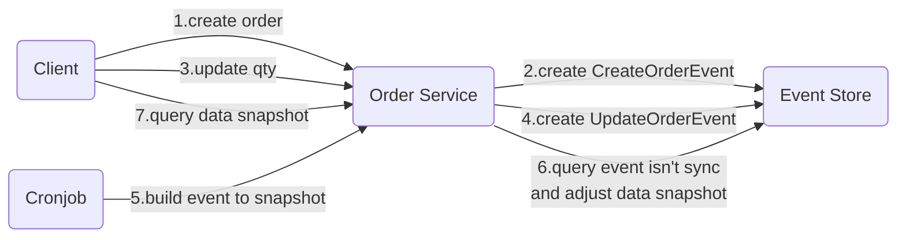
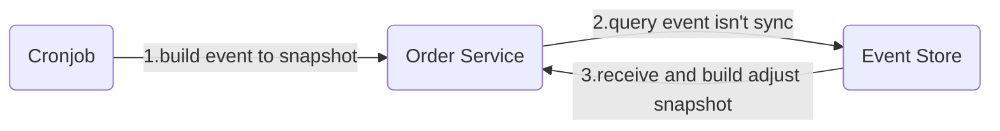
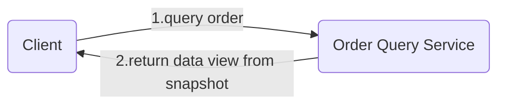
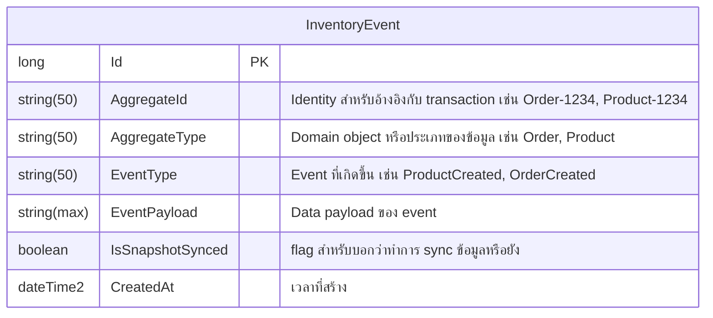
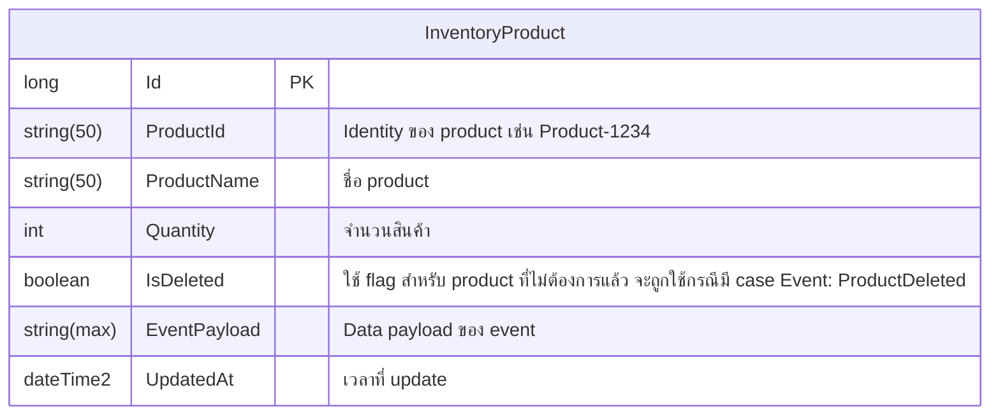

# Archetecture

## Event Sourcing

### Event Store

### Cronjob

### View

### Intro

- เราจะต้อง list ทางเข้าทั้งหมดที่ทำให้เกิดการเปลี่ยนแปลงข้อมูล
- เราต้อง design event ให้ cover ในจุดต่างๆ ที่เราสนใจ
- เราต้องทำ function สร้าง event ในจุดเหล่านั้น
- เราจะทำ api สำหรับ ดึงข้อมูลจาก table snapshot
- เราจะทำ api สำหรับ ดึงข้อมูล history ด้วย identity จาก table event

### API Recommend

- /fetch/fullhistory/{order-id} -- query from event, snapshot and order-detail
- /fetch/order-list (need-filter-by-default) -- query from snapshot

### Component

- **Event Store:** ที่เก็บ event สำหรับการทำ snapshot ของ inventory

- **Inventory Product:** ใช้ในการเก็บ current data ของ product (snapshot) โดย data ใน table นี้ต้องเกิดจากการ build event ใน event store เท่านั้น

