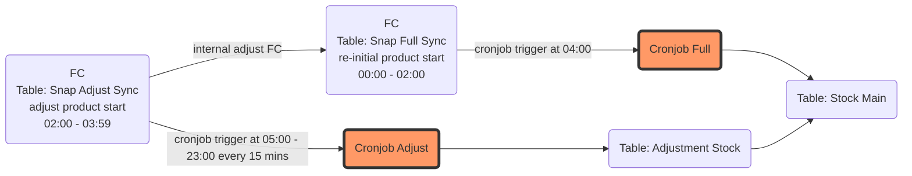
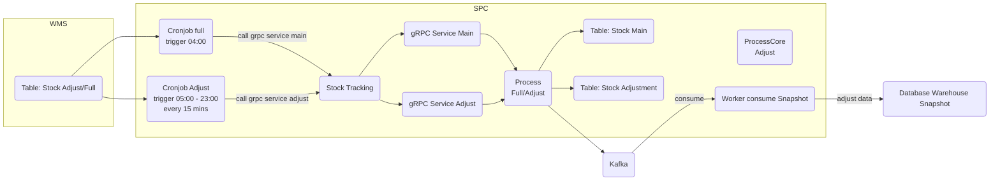
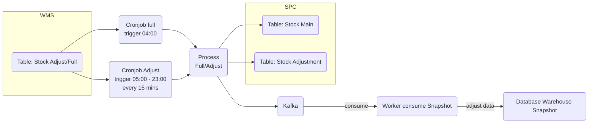
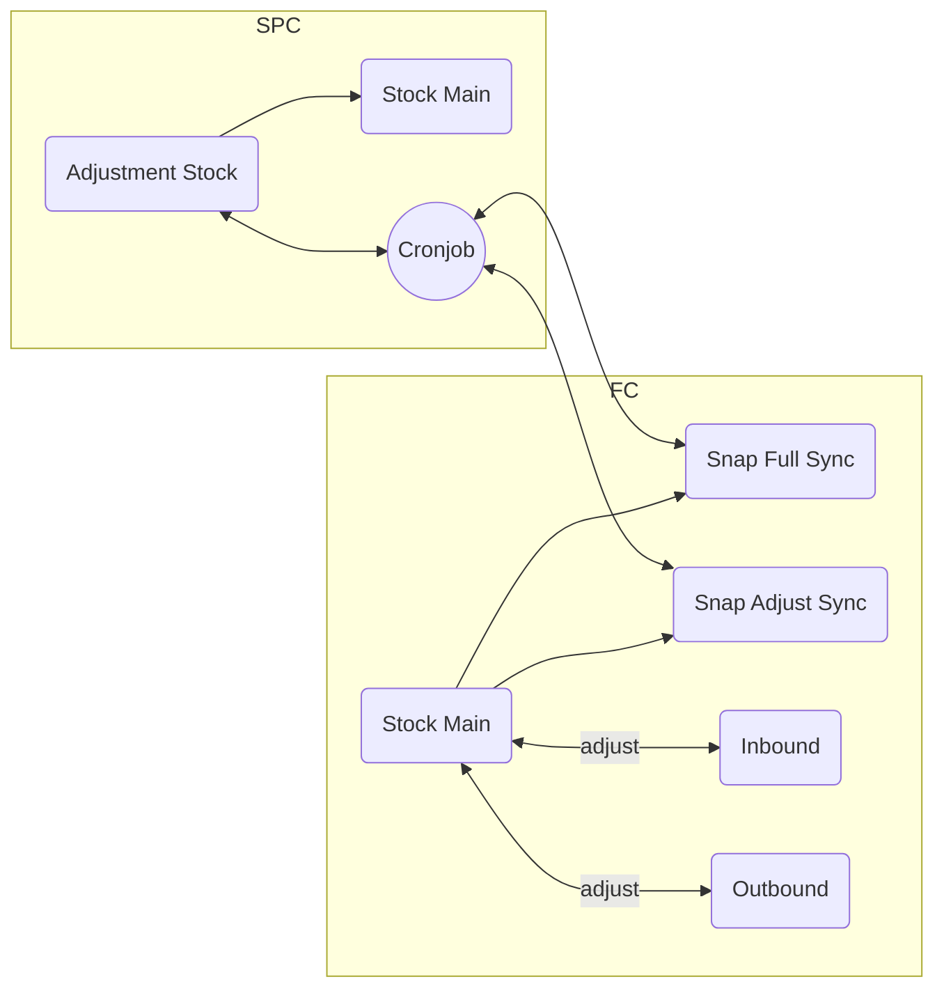

# Archetecture

งาน:
- ปรับ performance cronjob adjust อาจจะไป check full เผือด้วย
- ทำ table เพิ่มสำหรับ sync data จาก stock main

## Overview

### Data flow cycle

### Solutions

**Longterm**

**Shortterm**

**Step process both Full/Adjust:**

1. query snapshot table from *WMS(Adjust/Full)* sync to *stockadjustment(SPC)*
2. build data in *stockadjustment(SPC)* are new records to adjust data in *stock(SPC)*
3. create event for stockadjustment and send to Kafka
4. create event for stock and send to Kafka

**Plan:**

- เนื่องจากในส่วนของ datasource ทางฝั่ง FC ในอนาคตอาจจะมี การเพิ่ม BU เพิ่มขึ้นเรื่อยๆ อาจจะต้อง fucus การ scale ที่ฝั่งเราด้วย โดยเฉพาะ table snapshot ที่ในอนาคต เราต้องการกดดู history ของมันได้ เราก็ต้องทำการ snap เหมือนกัน
- ระบบต้องมี notify ตาม limit ที่ setting ถ้า product ถึง limit ต้องมีการ notify ออกมา
- ต้องมี Team notify สำหรับ fail case
- แยก cronjob สำหรับ purge data แยกมาอีกตัวนึงสำหรับเคลีย data เก่า
- อยากปรับ logic การดึงข้อมูลจาก track ด้วย SyncStock_seq เป็น track ด้วย ID เนื่องจากมัน track ได้ระดับ record เพราะว่า syncstock_seq มันซ้ำกันได้ทำให้ยากต่อการ track ว่า syncstock_seq นี้เข้ามาครบไหม
- อยากมี table เก็บ last_stock running in database แทน query max SyncSequence

**Confirm and Question**

- จำเป็นต้องลบ data ทั้งหมดใน stock ออกหมด ก่อน sync ไหม อยากจะปรับ เป็น update กับ insert พอ => ไม่ได้ต้องลบหมด
- table stockadjustment ใช่ table ที่ใช้สำหรับการ view movement ของ product ทั้งหมด ใช่ไหม? => ใช่
- table stock ใช้ในการ view ในหน้าจอของ FE สำหรับการดู qty ล่าสุด รวมถึง available กับ reserved => ใช่
- key ของ stock ที่เราทำการ adjustment ระหว่าง *stockadjustment* กับ *stock* คือ ('product_id', 'warehouse_id', 'location_id' , 'owner_id') ใช่ไหม => ใช่

- อยากได้ ตำแหน่งของ resource ที่ใช้ในการ calculate ค่า Available Qty กับ Reserved Qty เช่น database ตัวไหน, table อะไร และ field ไหน (ติดไว้ก่อน ไว้กลับมาคุยกับพี่แจส)
- stockadjustment จาก WMS เราต้องจัดการกับข้อมูลซ้ำกันยังไง ในกรณีถ้า data duplicate ข้อมูลตาม fields key เหล่านี้ ('Product_ID','location_ID','Warehouse_ID','syncstock_seq','Owner_ID'] เช่น

**Case 1 ซ้ำในกรณี ข้อมูล keys และ qty เหมือนกันหมดเลย**
| Product_ID | LocationGroup | Warehouse_ID | syncstock_seq | Owner_ID | Movement_QtyBal |
| :- | :- | :- | :- | :- | -: |
| productId1 | 1060 | 1005 | 45858 | CMG | -1 |
| productId1 | 1060 | 1005 | 45858 | CMG | -1 |

นอกเหนือจาก ID และ Create_Date ถ้า fields อื่นๆ ที่เราสนใจข้อมูลซ้ำ ถือว่าข้อมูลนั้นซ้ำ แล้วก็เอาเข้าแค่ตัวแรกตัวเดียว

**Case 2 ซ้ำในกรณี ข้อมูล keys เหมือนกัน แต่ qty ต่างกัน**
| Product_ID | LocationGroup | Warehouse_ID | syncstock_seq | Owner_ID | Movement_QtyBal |
| :- | :- | :- | :- | :- | -: |
| productId1 | 1060 | 1005 | 45858 | CMG | -1 |
| productId1 | 1060 | 1005 | 45858 | CMG | 2 |

ุถ้าเป็น case นี้ถือว่า เป็น 2 records แล้วทำงานปกติ

**Case 3 ซ้ำในกรณี ข้อมูล keys และ qty เหมือนกันหมดเลย แต่เป็น จังหวะ Stock Full Sync**
| Product_ID | LocationGroup | Warehouse_ID | syncstock_seq | Owner_ID | Binbalance_QtyBal |
| :- | :- | :- | :- | :- | -: |
| productId1 | 1060 | 1005 | 45858 | CMG | 2 |
| productId1 | 1060 | 1005 | 45858 | CMG | 2 |

ถ้าเกิดเจอเคสนี้ เอาเข้าแค่ตัวแรกตัวเดียว

### Intro
- Cronjob Full: ทำหน้าที่ในการ re-initial data ใหม่ มาแทนที่ โดยจะทำงานช่วงเวลา 04:00 ของทุกวัน เนื่องจากทางฝั่ง FC เขาจะมีการ re-adjust เพื่อให้ data up to date ซึงฝั่ง FC เขาจะ re-cale data ในแต่ละวัน เสร็จก่อนตี 4 เสมอ
- Cronjob Adjust: ทำหน้าที่ในการ ดึงข้อมูล adjust จาก table adjust ของ FC มา update ที่ฝั่ง SPC และ re-build adjust data to Stock Main ของ SPC โดยเงื่อนไขการทำงานหลักๆ มีดังนี้
    
    * ดึงข้อมูลตาม flag version ที่ใหม่กว่า ที่กำหนดไว้ มาเก็บไว้ที่ Stock Adjust ของ FC
    * build adjust data ที่เข้ามาใหม่ทั้งหมดใน table Stock Adjust ของ SPC เพื่อ update/insert ไปที่ Stock Main ของ SPC แต่มีเงื่อนไข adjust data ตามนี้
        
        - event ที่ได้รับ ถ้ามีการส่ง qty มาแต่ สถานะ เป็นค่าติดลบ และเมื่อมีการหักลบออกจาก Product ใน stock main แล้วได้ค่าติดลบ จะ Ignore event นั้น
        - event ที่ได้รับ มีการส่ง qty มา และสถานะเป็นค่าบวก แต่ไม่มี product ใน stock main ให้ทำการสร้าง record ใหม่ใน stock main ได้เลย (หมายเหตุ ข้อมูลใน event ต้องเพียงพอต่อการสร้าง order)
        - event ที่ได้รับนอกเหนือจากนั้น ให้ +/- qty ปกติ

**Implement**

- ทำ cronjob sync main ใหม่ โดย function มีดังนี้
    - ทำ function ต่อ gRPC ไปที่ gRPC Stock Main
    - ทำ function mapping request gRPC to Stock Main
- ทำ cronjob sync adjust ใหม่
    - ทำ function ต่อ gRPC ไปที่ gRPC Stock Adjust
    - ทำ function mapping request gRPC to Stock Adjust
- initial gRPC protocal บน web service (Stock Service)
- ทำ function ที่รับ request จาก gRPC Main โดย function ที่ทำมีดังนี้
    - ทำ controller รับ gRPC สำหรับขา Stock Main
    - ทำ function sync data จาก Stock Adjust Main FC sync to Stock Adjust SPC
    - ทำ function calulate data จาก Stock Adjust SPC ที่เข้ามาใหม่ เพื่อ adjust data บน Stock Main SPC
    - เรียกใช้ function core สำหรับ build event sync Stock Adjust SPC
    - เรียกใช้ function core สำหรับ build event sync Stock SPC
    - ทำ notify กรณี case fail
- ทำ function ที่รับ request จาก gRPC Adjust โดย function ที่ทำมีดังนี้
    - ทำ controller รับ gRPC สำหรับขา Stock Adjust
    - ทำ function sync data จาก Stock Adjust FC sync to Stock Adjust SPC
    - ทำ function calulate data จาก Stock Adjust SPC ที่เข้ามาใหม่ เพื่อ adjust data บน Stock Main SPC
    - เรียกใช้ function core สำหรับ build event sync Stock Adjust SPC
    - เรียกใช้ function core สำหรับ build event sync Stock Main SPC
    - ทำ notify กรณี case fail
- ทำ function core สำหรับ build event sync Stock (Main/Adjust) SPC และ produce message ไปที่ Kafka
- ทำ worker สำหรับ consume message event โดย function การทำงานมีดังนี้
    - ทำ function consume message จาก kafka
    - ทำ function รับ event แล้ว sync data มาเก็บไว้ที่ database warehouse
    - ทำ notify กรณี case fail
- Implement API for fetch data from database warehouse
    - Initial project for WebAPI (Authen, Log, Layout UnitTest)
    - ทำ function สำหรับ provide data ให้ FE
    - Database migration
- ทำ Sequence diagram สำหรับ function process
    - cronjob adjust
    - cronjob full
    - consume worker
    - API service for FE (ยังไม่ทำ รอคุยหน้าจอกับ FE ก่อน)
- ทำ ER-diagram สำหรับ database warehouse
- ทำ API Spec for FE
- Initial project ETL Net Cronjob(Inital project in new repro)
- Migrate Data สำหรับการย้าย field + เพิ่ม field ใหม่
- Design รูปแบบ event สำหรับ sync data ไปให้ consumer ไป adjust(CRUD) data

### Problem Prod
- Stock Full Sync ส่งเบิ้ล need handle

### Need TODO
- ทำเรื่องขอขึ้น service ใหม่
- ทำเรื่องขอ kafka สำหรับใช้ sync ข้อมูล ไป database warehouse
- อธิบายการขึ้น cronjob ที่จะไป กับสอบถามการวาง service cronjob เก่าจากทีม
- สอบถาม อาหลง ว่าการปรับ field และ migrate data พี่ผลกระทบกับส่วนอื่นหรือป่าว เช่น service ที่ดึง data ไปทำ report
- type ของ field เก่า ที่ไม่ตรงกับ Source
    - SyncStockSeq
    - BinbalanceQtyBal
    - location_ID
- สอบถาม อาหลง ว่าปัจจุบันเราเคลีย stockadjustment ของ SPC ยังไง เพราะอาจจะต้องคิดเผื่อตอน ส่งไปเคลียที่ฝั่ง consumer ด้วย

### Database

SPRINT_SNAP_WMS_CMG -> table: Onwms_Snap_Adjust_Stock
SPRINT_SNAP_WMS_CMG -> table: Onwms_Snap_Stock

### Question
- กรณีที่มี case เกิดประมาณนี้ เราจะ handle reserve qty กับ available qty ยังไง
init qty = 1
            adjust +, qty = 2
            adjust -, qty = -1 sum: => 4

            full, qty = 6 
                missing snap step: 
                    adjust -, qty = -1
                    adjust +, qty = 3

Note: - Reserve Qty: คือ adjust type summary qty flag -
    - Available Qty: คือ current qty - Reserve Qty

### Background

**Ubiquitous Language**
- Inbound: สั่งซื้อสินค้า, สินค้านำเข้า เป็นสินค้าที่สั่งซื้อไว้เพื่อที่จะเก็บไว้ใน stock สินค้า
- Outbound: สินค้าที่ถูกขายออก คือสินค้าที่ถูกขายออกไป เมื่อถูกขายจะนำออกจาก stock สินค้า
- Stock Main: เป็น core management stock สินค้า ว่ามีเพิ่มเข้ามา หรือลดลง
- Cronjob: เป็น cronjob ที่ทำหน้าที่ในการ sync data ระหว่าง FC กับ SPC
- Reserve Qty: คือ adjust type summary qty flag -
- Available Qty: คือ current qty - Reserve Qty
