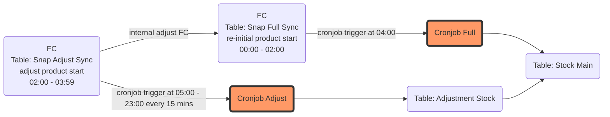
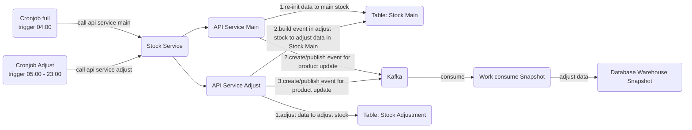
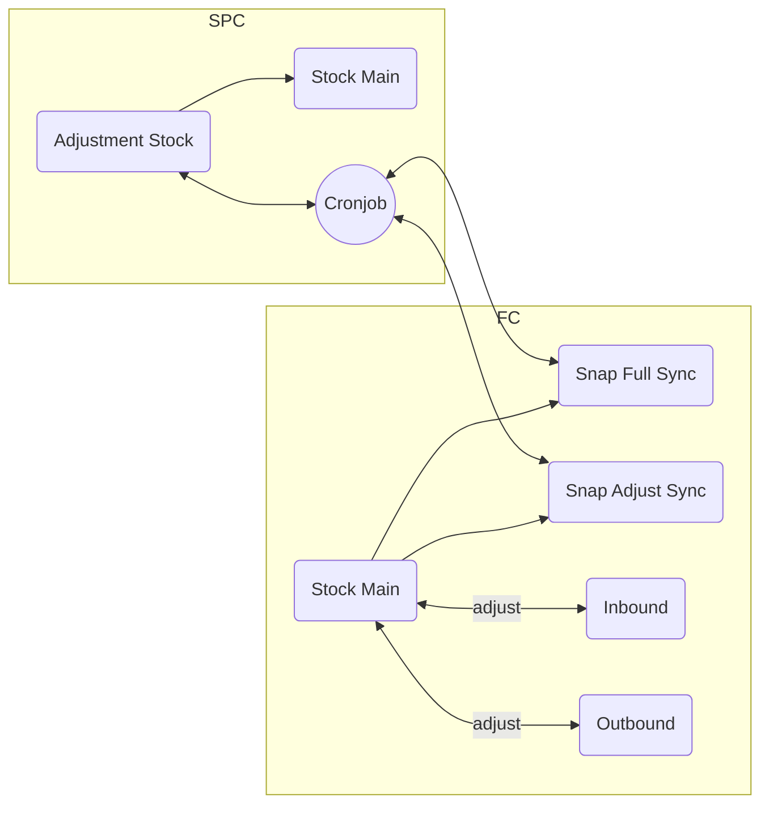
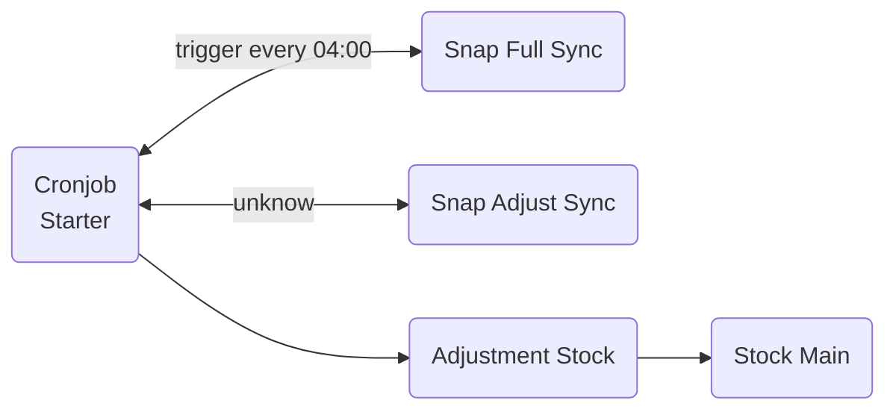
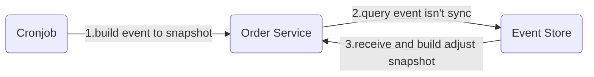
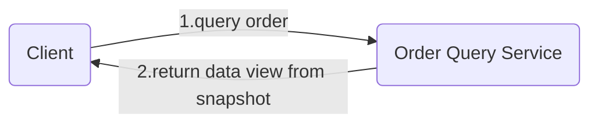
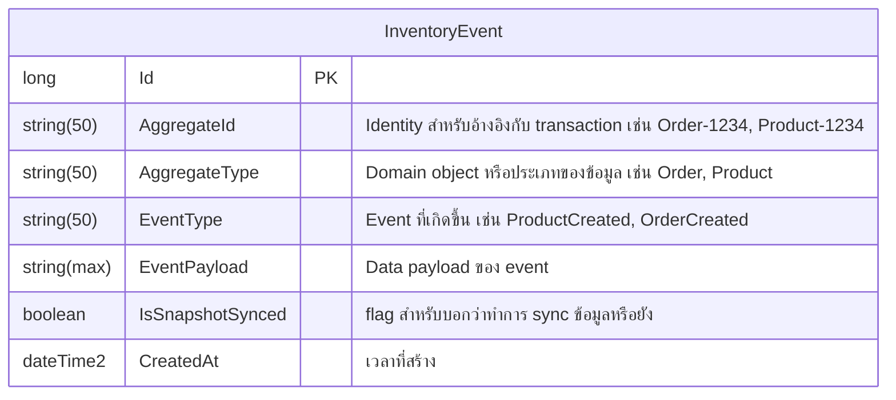
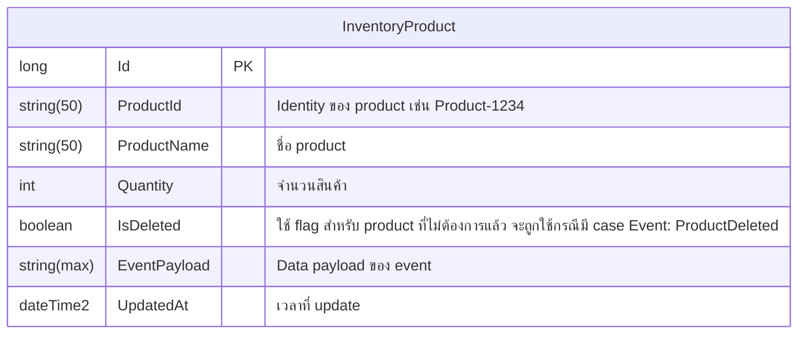

# Archetecture

งาน:
- ปรับ performance cronjob adjust อาจจะไป check full เผือด้วย
- ทำ table เพิ่มสำหรับ sync data จาก stock main

## Overview

### Data flow cycle

### Solutions

**Detail**
- Cronjob Full: ทำหน้าที่ในการ re-initial data ใหม่ มาแทนที่ โดยจะทำงานช่วงเวลา 04:00 ของทุกวัน เนื่องจากทางฝั่ง FC เขาจะมีการ re-adjust เพื่อให้ data up to date ซึงฝั่ง FC เขาจะ re-cale data ในแต่ละวัน เสร็จก่อนตี 4 เสมอ
- Cronjob Adjust: ทำหน้าที่ในการ ดึงข้อมูล adjust จาก table adjust ของ FC มา update ที่ฝั่ง SPC และ re-build adjust data to Stock Main ของ SPC โดยเงื่อนไขการทำงานหลักๆ มีดังนี้
    
    * ดึงข้อมูลตาม flag version ที่ใหม่กว่า ที่กำหนดไว้ มาเก็บไว้ที่ Stock Adjust ของ FC
    * build adjust data ที่เข้ามาใหม่ทั้งหมดใน table Stock Adjust ของ SPC เพื่อ update/insert ไปที่ Stock Main ของ SPC แต่มีเงื่อนไข adjust data ตามนี้
        
        - event ที่ได้รับ ถ้ามีการส่ง qty มาแต่ สถานะ เป็นค่าติดลบ และเมื่อมีการหักลบออกจาก Product ใน stock main แล้วได้ค่าติดลบ จะ Ignore event นั้น
        - event ที่ได้รับ มีการส่ง qty มา และสถานะเป็นค่าบวก แต่ไม่มี product ใน stock main ให้ทำการสร้าง record ใหม่ใน stock main ได้เลย (หมายเหตุ ข้อมูลใน event ต้องเพียงพอต่อการสร้าง order)
        - event ที่ได้รับนอกเหนือจากนั้น ให้ +/- qty ปกติ

### Background

**Ubiquitous Language**
- Inbound: สั่งซื้อสินค้า, สินค้านำเข้า เป็นสินค้าที่สั่งซื้อไว้เพื่อที่จะเก็บไว้ใน stock สินค้า
- Outbound: สินค้าที่ถูกขายออก คือสินค้าที่ถูกขายออกไป เมื่อถูกขายจะนำออกจาก stock สินค้า
- Stock Main: เป็น core management stock สินค้า ว่ามีเพิ่มเข้ามา หรือลดลง
- Cronjob: เป็น cronjob ที่ทำหน้าที่ในการ sync data ระหว่าง FC กับ SPC

## Event Sourcing

### Event Store

### Cronjob

### View

### Intro

- เราจะต้อง list ทางเข้าทั้งหมดที่ทำให้เกิดการเปลี่ยนแปลงข้อมูล
- เราต้อง design event ให้ cover ในจุดต่างๆ ที่เราสนใจ
- เราต้องทำ function สร้าง event ในจุดเหล่านั้น
- เราจะทำ api สำหรับ ดึงข้อมูลจาก table snapshot
- เราจะทำ api สำหรับ ดึงข้อมูล history ด้วย identity จาก table event

### API Recommend

- /fetch/fullhistory/{order-id} -- query from event, snapshot and order-detail
- /fetch/order-list (need-filter-by-default) -- query from snapshot

### Component

- **Event Store:** ที่เก็บ event สำหรับการทำ snapshot ของ inventory

- **Inventory Product:** ใช้ในการเก็บ current data ของ product (snapshot) โดย data ใน table นี้ต้องเกิดจากการ build event ใน event store เท่านั้น

