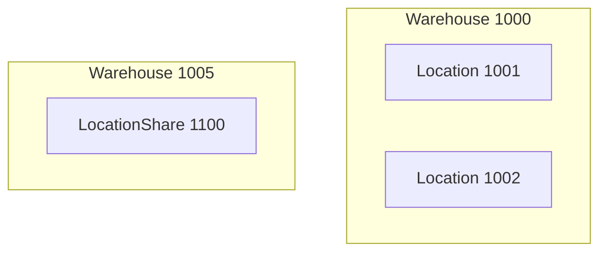

**Description**

ปัจจุบัน process การทำงานของ ระบบ warehouse มี 2 แบบ

1. warehouse ที่มีขนาดเล็กจะมีการเก็บสินค้าที่ location เดียวกัน
2. warehouse ที่มีการแยก location สำหรับการขาย เช่น 1001 ขาย offline, 1002 ขาย online โดยทั้ง 2 ที่ stock สินค้าแยก location กัน

สรุป: บาง BU warehouse เดียวกันแต่มี 2 location แยกสินค้าในการเก็บ stock กัน จุดประสงค์เพื่อเอาไว้ขายคนละที่
บาง BU ไม่ได้มีที่เก็บใหญ่มากก็จะเก็บสินค้าที่เดียวกัน

| BU | Warehouse | Location | Product | QTY | QTYAvailable | QTY Reserver |
| :- | :- | :- | :- | :- | :- | :- |
| AAA | 1000 | 1001 | Coke | 1 | 0 | 1 |
| AAA | 1000 | 1002 | Coke | 1 | 1 | 0 |
| BBB | 1100 | 1100 | Coke | 2 | 1 | 1 |