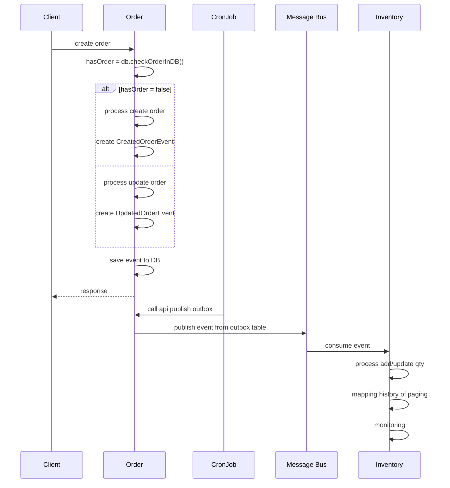

```mermaid
sequenceDiagram
    participant Client
    participant Order
    participant CronJob
    participant Message Bus
    participant Inventory
    Client->> Order: create order
    Order->> Order: hasOrder = db.checkOrderInDB()
    alt hasOrder = false 
        Order->> Order: process create order
        Order->> Order: create CreatedOrderEvent
    else
        Order->> Order: process update order
        Order->> Order: create UpdatedOrderEvent
    end
    Order->> Order: save event to DB
    Order-->> Client: response
    CronJob->> Order: call api publish outbox
    Order->> Message Bus: publish event from outbox table
    Message Bus->> Inventory: consume event
    Inventory->>Inventory: process add/update qty
    Inventory->>Inventory: mapping history of paging
    Inventory->>Inventory: monitoring

```