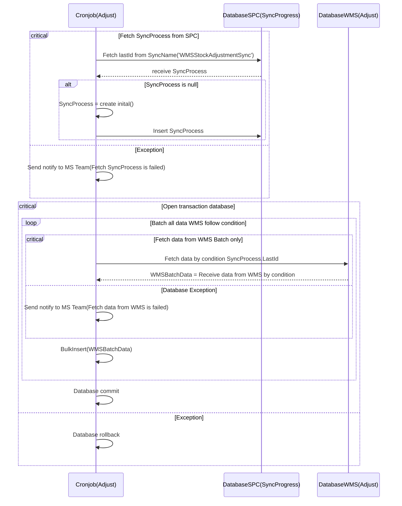
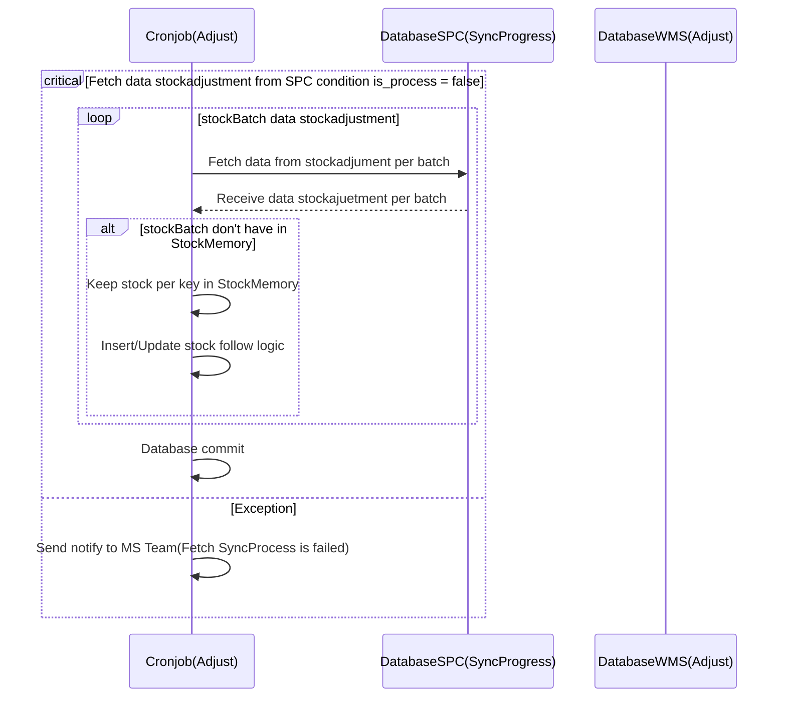

# Sequence diagram adjustment

### Sync adjustment data from WMS to SPC

### TODO: [Not Done] Compute data stockadjustment to stock in SPC

### Very Shot Term

### Need TODO
- ทำเรื่องขอขึ้น service ใหม่
- สอบถาม ว่าปัจจุบันเราเคลีย stockadjustment ของ SPC ยังไง เพราะอาจจะต้องคิดเผื่อตอน ส่งไปเคลียที่ฝั่ง consumer ด้วย -> รอทำ phase ถัดไป

**Target Database new table**
- Inventory
    - stock main : spc_crl_main
    - stock adjust : spc_crl_adjustment
- Data mart
    - Front end-connect inteface : spc_temp_stock_crl

*Detail*

    sku(FC) = product_id(SPC)
    product_id(FC) = barocde(SPC)
    sku = ไม่ส่ง
    product_id = barcode

**Concern:** 
- maybe impact if it must to purge data for sync every 15 mins