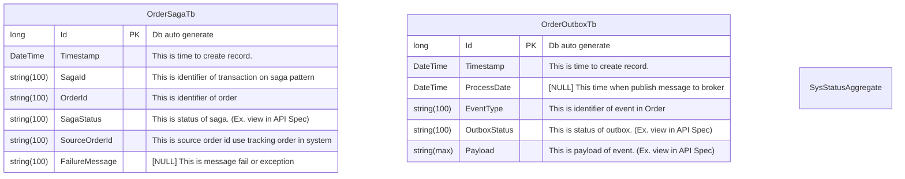

```mermaid
erDiagram
    OrderSagaTb {
        long Id PK "Db auto generate"
        DateTime Timestamp "This is time to create record."
        string(100) SagaId "This is identifier of transaction on saga pattern"
        string(100) OrderId "This is identifier of order"
        string(100) SagaStatus "This is status of saga. (Ex. view in API Spec)"
        string(100) SourceOrderId "This is source order id use tracking order in system"
        string(100) FailureMessage "[NULL] This is message fail or exception"
    }
    OrderOutboxTb {
        long Id PK "Db auto generate"
        DateTime Timestamp "This is time to create record."
        DateTime ProcessDate "[NULL] This time when publish message to broker"
        string(100) EventType "This is identifier of event in Order"
        string(100) OutboxStatus "This is status of outbox. (Ex. view in API Spec)"
        string(max) Payload "This is payload of event. (Ex. view in API Spec)"
    }
    SysStatusAggregate {
        
    }
```