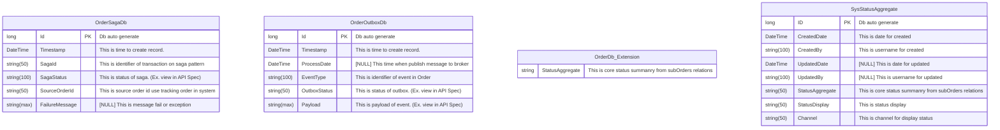

```mermaid
erDiagram
    OrderSagaDb {
        long Id PK "Db auto generate"
        DateTime Timestamp "This is time to create record."
        string(50) SagaId "This is identifier of transaction on saga pattern"
        string(100) SagaStatus "This is status of saga. (Ex. view in API Spec)"
        string(50) SourceOrderId "This is source order id use tracking order in system"
        string(max) FailureMessage "[NULL] This is message fail or exception"
    }
    OrderOutboxDb {
        long Id PK "Db auto generate"
        DateTime Timestamp "This is time to create record."
        DateTime ProcessDate "[NULL] This time when publish message to broker"
        string(100) EventType "This is identifier of event in Order"
        string(50) OutboxStatus "This is status of outbox. (Ex. view in API Spec)"
        string(max) Payload "This is payload of event. (Ex. view in API Spec)"
    }
    OrderDb_Extension {
        string StatusAggregate "This is core status summanry from subOrders relations"
    }
    SysStatusAggregate {
        long ID PK "Db auto generate"
        DateTime CreatedDate "This is date for created"
        string(100) CreatedBy "This is username for created"
        DateTime UpdatedDate "[NULL] This is date for updated"
        string(100) UpdatedBy "[NULL] This is username for updated"
        string(50) StatusAggregate "This is core status summanry from subOrders relations"
        string(50) StatusDisplay "This is status display"
        string(50) Channel "This is channel for display status"
    }
```