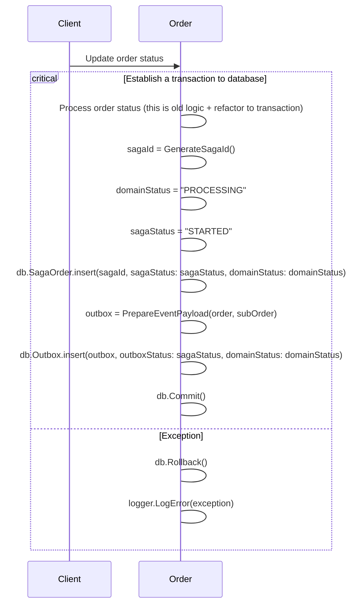

```mermaid
sequenceDiagram
    participant Client
    participant Order
    Client->>Order: Update order status
    critical Establish a transaction to database
        Order->Order: Process order status (this is old logic + refactor to transaction)
        Order->Order: sagaId = GenerateSagaId()
        Order->Order: domainStatus = "PROCESSING"
        Order->Order: sagaStatus = "STARTED"
        Order->Order: db.SagaOrder.insert(sagaId, sagaStatus: sagaStatus, domainStatus: domainStatus)
        Order->Order: outbox = PrepareEventPayload(order, subOrder)
        Order->Order: db.Outbox.insert(outbox, outboxStatus: sagaStatus, domainStatus: domainStatus)
        Order->Order: db.Commit()
    option Exception
        Order->Order: db.Rollback()
        Order->Order: logger.LogError(exception)
    end
```