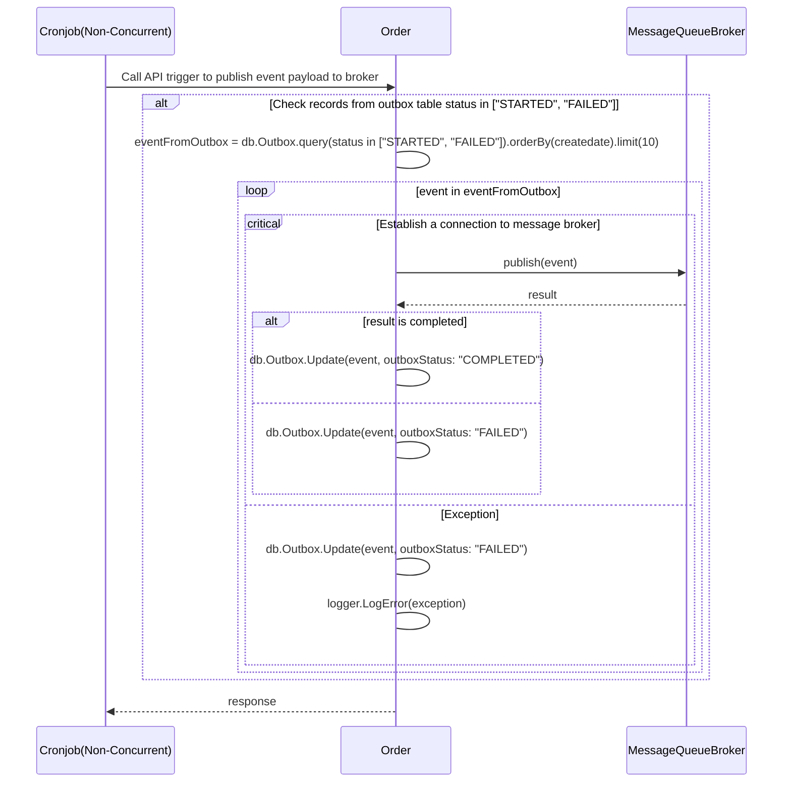

```mermaid
sequenceDiagram
    participant Cronjob(Non-Concurrent)
    participant Order
    participant MessageQueueBroker
    Cronjob(Non-Concurrent)->>Order: Call API trigger to publish event payload to broker
    alt Check records from outbox table status in ["STARTED", "FAILED"]
        Order->Order: eventFromOutbox = db.Outbox.query(status in ["STARTED", "FAILED"]).orderBy(createdate).limit(10)
        loop event in eventFromOutbox
            critical Establish a connection to message broker
                Order->>MessageQueueBroker: publish(event)
                MessageQueueBroker-->>Order: result
                alt result is completed
                    Order->Order: db.Outbox.Update(event, outboxStatus: "COMPLETED")
                else
                    Order->Order: db.Outbox.Update(event, outboxStatus: "FAILED")
                end
            option Exception
                Order->Order: db.Outbox.Update(event, outboxStatus: "FAILED")
                Order->Order: logger.LogError(exception)
            end
        end
    end
    Order-->>Cronjob(Non-Concurrent): response
```