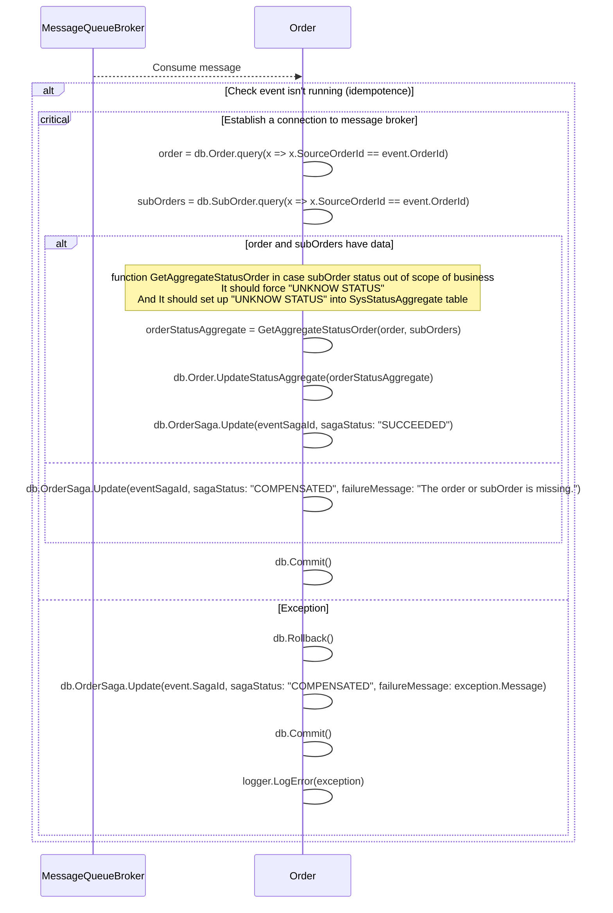

```mermaid
sequenceDiagram
    participant MessageQueueBroker
    participant Order
    MessageQueueBroker-->>Order: Consume message
    alt Check event isn't running (idempotence)
        critical Establish a connection to message broker
            Order->Order: order = db.Order.query(x => x.SourceOrderId == event.OrderId)
            Order->Order: subOrders = db.SubOrder.query(x => x.SourceOrderId == event.OrderId)
            alt order and subOrders have data
                Note over Order: function GetAggregateStatusOrder in case subOrder status out of scope of business<br/>It should force "UNKNOW STATUS"<br/>And It should set up "UNKNOW STATUS" into SysStatusAggregate table
                Order->Order: orderStatusAggregate = GetAggregateStatusOrder(order, subOrders)
                Order->Order: db.Order.UpdateStatusAggregate(orderStatusAggregate)
                Order->Order: db.OrderSaga.Update(eventSagaId, sagaStatus: "SUCCEEDED")
            else
                Order->Order: db.OrderSaga.Update(eventSagaId, sagaStatus: "COMPENSATED", failureMessage: "The order or subOrder is missing.")
            end
            Order->Order: db.Commit()
        option Exception
            Order->Order: db.Rollback()
            Order->Order: db.OrderSaga.Update(event.SagaId, sagaStatus: "COMPENSATED", failureMessage: exception.Message)
            Order->Order: db.Commit()
            Order->Order: logger.LogError(exception)
        end
    end
```