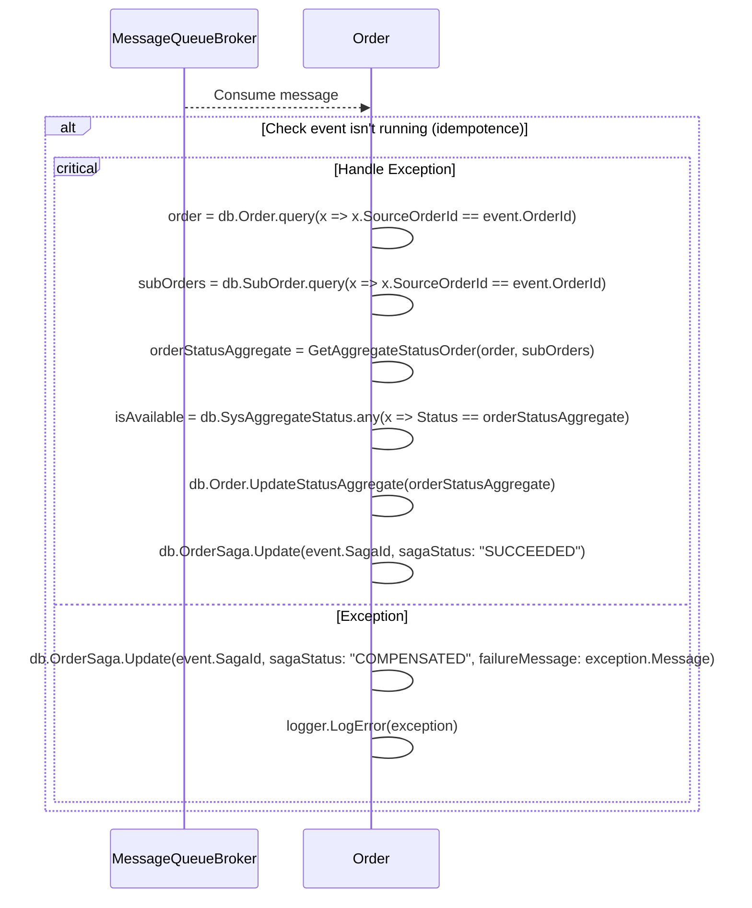

```mermaid
sequenceDiagram
    participant MessageQueueBroker
    participant Order
    MessageQueueBroker-->>Order: Consume message
    alt Check event isn't running (idempotence)
        critical Handle Exception
            Order->Order: order = db.Order.query(x => x.SourceOrderId == event.OrderId)
            Order->Order: subOrders = db.SubOrder.query(x => x.SourceOrderId == event.OrderId)
            Order->Order: orderStatusAggregate = GetAggregateStatusOrder(order, subOrders)
            Order->Order: isAvailable = db.SysAggregateStatus.any(x => Status == orderStatusAggregate)
            Order->Order: db.Order.UpdateStatusAggregate(orderStatusAggregate)
                Order->Order: db.OrderSaga.Update(event.SagaId, sagaStatus: "SUCCEEDED")
        option Exception
            Order->Order: db.OrderSaga.Update(event.SagaId, sagaStatus: "COMPENSATED", failureMessage: exception.Message)
            Order->Order: logger.LogError(exception)
        end
    end
```